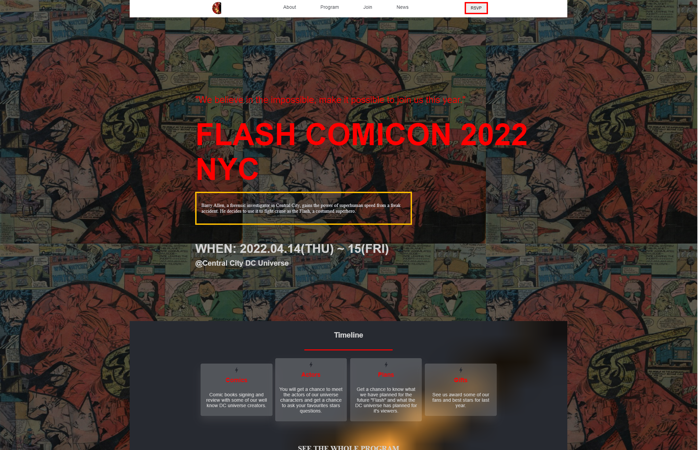
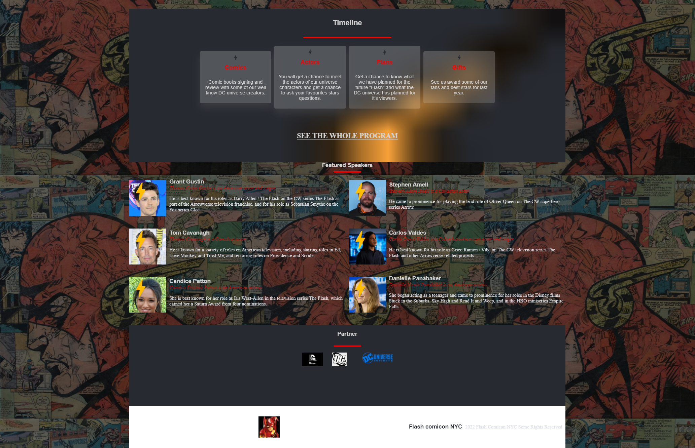
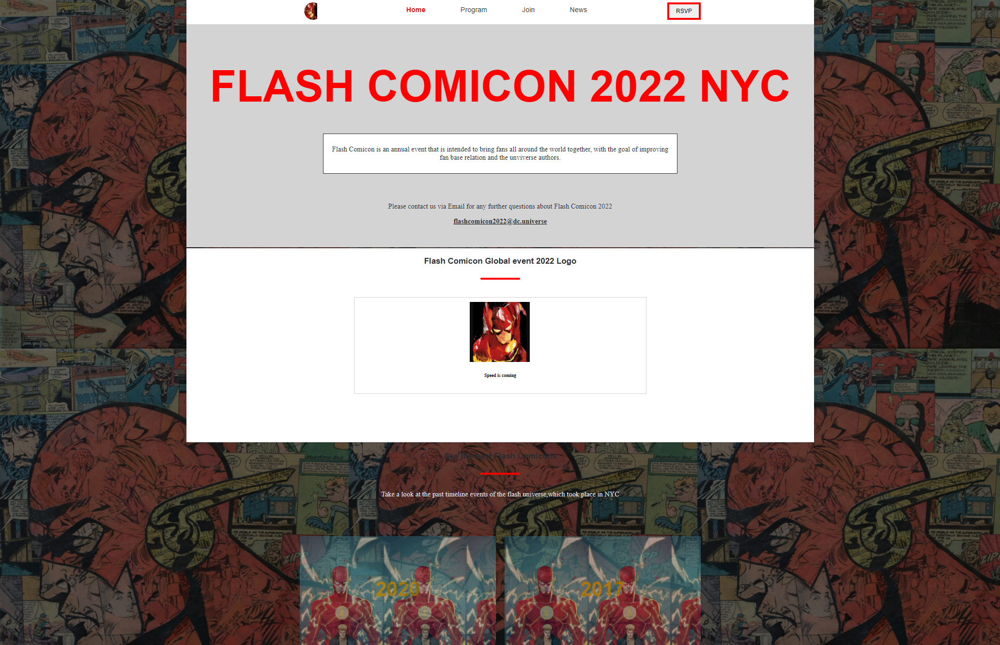
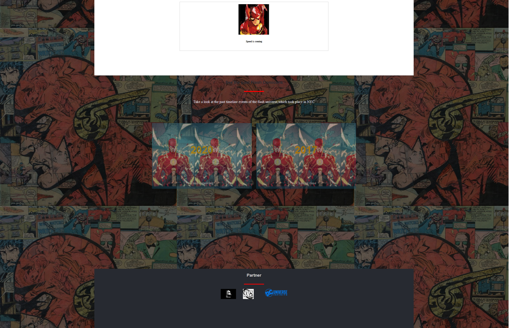
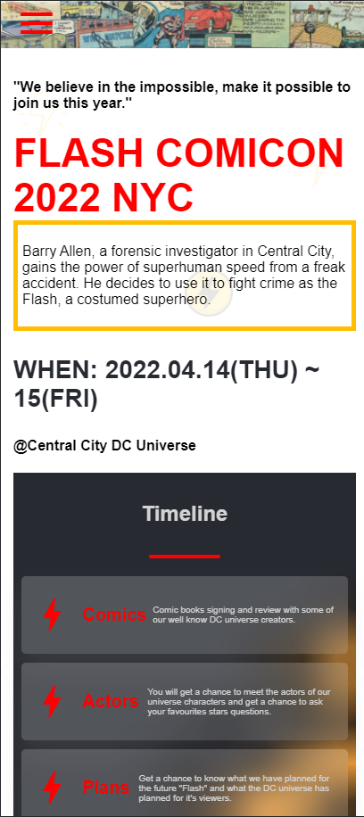
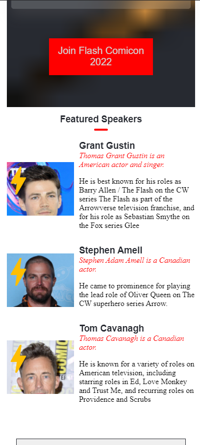
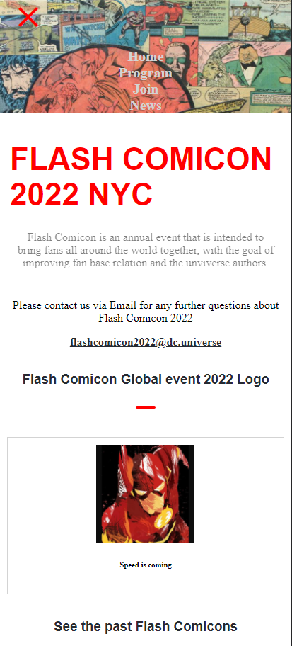
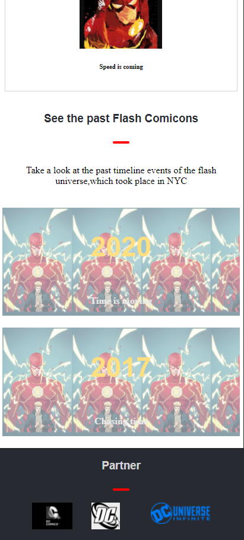

# Flash Comicon 2022

> Flash.
<!--  -->

## You can access the live site [here](https://bavon101.github.io/flash_comicon/)

Additional description about the project and its features.
This is dummy site that mimics how a live Comicon site of THE FLASH would look like 🐱‍🏍
The site show the list of casts the event data, and it's built in a comical design 😎.
## Screenshots Desktop 📷

## Screenshots Mobile 📷📲

## Built With

- HTML
- CSS
- JS

<!-- ## Live Demo -->

<!-- [Live Demo Link](https://livedemo.com) -->

## Getting Started

**This is dummy site that mimics how a live Comicon site of THE FLASH would look like 🐱‍🏍**

<!-- To get a local copy up and running follow these simple example steps.

### Prerequisites

### Setup

### Install

### Usage

### Run tests

### Deployment -->

## Authors

👤 **Author**

- GitHub: [@Bavon101](https://github.com/Bavon101)
<!-- - Twitter: [@twitterhandle](https://twitter.com/twitterhandle) -->
- LinkedIn: [LinkedIn](https://www.linkedin.com/in/akumu-bavon-335416193/)

## 🤝 Contributing

Contributions, issues, and feature requests are welcome!

Feel free to check the [issues page](../../issues/).

## Show your support

Give a ⭐️ if you like this project! and cheers✨

## Acknowledgments

- Microverse offered guidance on how to make the project more professional
- Microverse portfolio template guidance

## 📝 License

This project is [MIT](./MIT.md) licensed.
